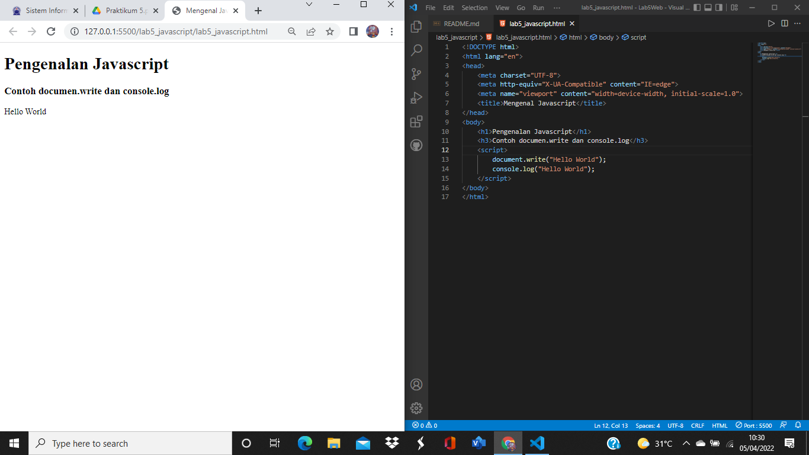
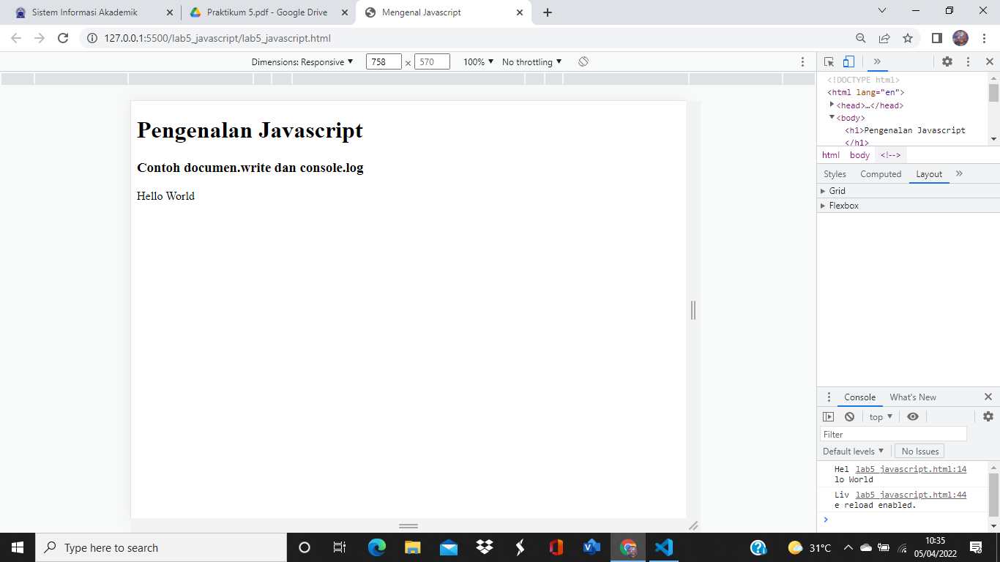
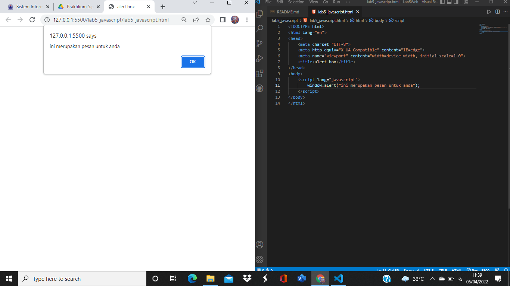
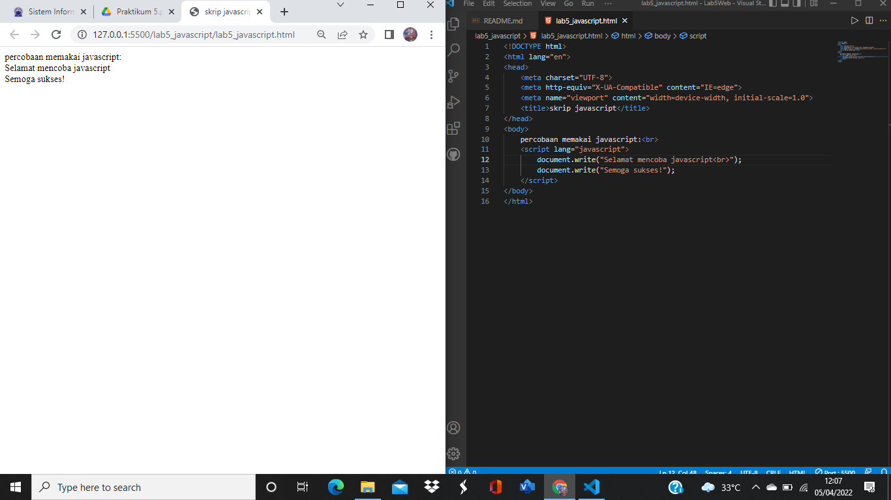
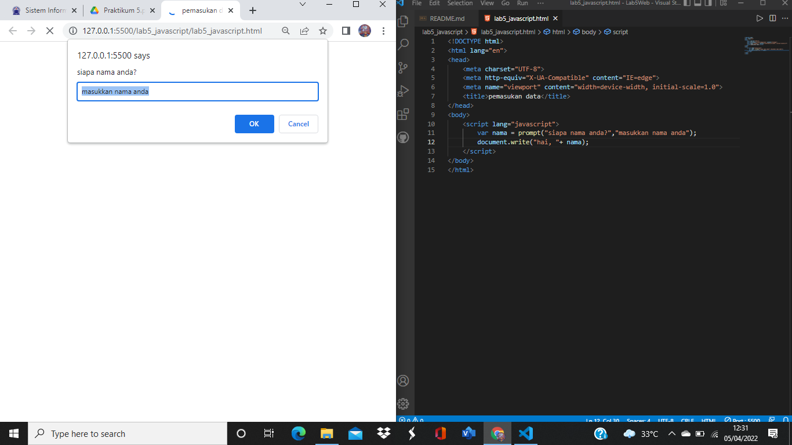

|   HERLIYANSYAH        |       312010387           |
| --------------------- | --------------------------|
| TI.20.A.2             |      PEMROGRAMAN WEB      |
| PERTEMUAN KE-6        |       PRAKTIKUM 5         |


## PERTEMUAN 6

## LAB 5 WEB 

Dipertemuan kali ini kita akan mempelajari **javascript** pada html,seperti penempatan **javascript** pada html di internal atau pun eksternal **javascript**

## 1). PERSIAPAN MEMBUAT DOKUMEN HTML DENGAN NAMA FILE **lab5_javascript.html** seperti berikut.

## CODE DAN TAMPILAN DIBROWSER NYA!


**PENJELASAN**

Disini adalah hasil dari output dengan menggunakan element javascript **documen.write** dan **console.log** namun untuk **console.log** tidak ditampilkan dibrowser,ada fitur khusus untuk menampilkan nya seperti gambar dibawah.



ini adalah output console.log seperti terlihat kanan bawah,terdapat fitur console dan didalam nya ada script hello world.

**code html**

```html
<!DOCTYPE html>
<html lang="en">
<head>
    <meta charset="UTF-8">
    <meta http-equiv="X-UA-Compatible" content="IE=edge">
    <meta name="viewport" content="width=device-width, initial-scale=1.0">
    <title>Mengenal Javascript</title>
</head>
<body>
    <h1>Pengenalan Javascript</h1>
    <h3>Contoh documen.write dan console.log</h3>
    <script>
        document.write("Hello World");
        console.log("Hello World");
    </script>
</body>
</html>
```

# JAVASCRIPT DASAR

## 2).PEMAKAIAN ALERT SEBAGAI PROPERTY WINDOW

## CODE DAN TAMPILAN DIBROWSER NYA!


**PENJELASAN**

Pemakaian **alert** sebagai property window,dia akan muncul di atas halaman dengan contoh gambar seperti di atas.

**code html dan script**

```html
<!DOCTYPE html>
<html lang="en">
<head>
    <meta charset="UTF-8">
    <meta http-equiv="X-UA-Compatible" content="IE=edge">
    <meta name="viewport" content="width=device-width, initial-scale=1.0">
    <title>alert box</title>
</head>
<body>
    <script lang="javascript">
        window.alert("ini merupakan pesan untuk anda");
    </script>
</body>
</html>
```

## 3). PEMAKAIAN METHOD DALAM OBJEK

## CODE DAN TAMPILAN DIBROWSER NYA!


**PENJELASAN**

Menggunakan ***Method*** dalam **objek** dengan javascript,seperti contoh gambar di atas.

**code html dan script**

```html
<!DOCTYPE html>
<html lang="en">
<head>
    <meta charset="UTF-8">
    <meta http-equiv="X-UA-Compatible" content="IE=edge">
    <meta name="viewport" content="width=device-width, initial-scale=1.0">
    <title>skrip javascript</title>
</head>
<body>
    percobaan memakai javascript:<br>
    <script lang="javascript">
        document.write("Selamat mencoba javascript<br>");
        document.write("Semoga sukses!");
    </script>
</body>
</html>
```

## 4). PEMAKAIAN PROMPT

## CODE DAN TAMPILAN DIBROWSER NYA!


**PENJELASAN**

Menggunakan **Prompt** pada script seperti gambar di atas

**code html dan script**

```html
<!DOCTYPE html>
<html lang="en">
<head>
    <meta charset="UTF-8">
    <meta http-equiv="X-UA-Compatible" content="IE=edge">
    <meta name="viewport" content="width=device-width, initial-scale=1.0">
    <title>pemasukan data</title>
</head>
<body>
    <script lang="javascript">
        var nama = prompt("siapa nama anda?","masukkan nama anda");
        document.write("hai, "+ nama);
    </script>
</body>
</html>
```

## 5).PEMBUATAN FUNGSI DAN CARA PEMANGGILANNYA

## CODE DAN TAMPILAN DIBROWSER NYA!


**PENJELASAN**

Menggunakan Function dengan body onload di javascript seperti gambar di atas

**code html dan script**

```html
<!DOCTYPE html>
<html lang="en">
<head>
    <meta charset="UTF-8">
    <meta http-equiv="X-UA-Compatible" content="IE=edge">
    <meta name="viewport" content="width=device-width, initial-scale=1.0">
    <title>Contoh Program javascript</title>
    <script lang="javascript">
        function pesan(){
            alert ("Memanggil javascript lewat body onload")
        }
    </script>
</head>
<body onload=pesan()>
    
</body>
</html>
```

## DASAR PEMROGRAMAN DI JAVASCRIPT

## 6). OPERASI DASAR ARITMATIKA