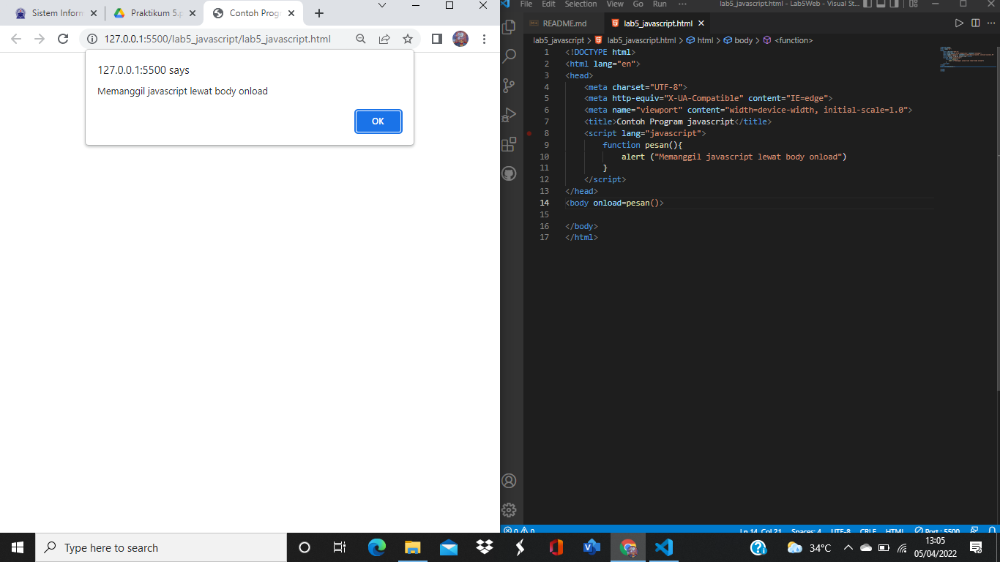

|   HERLIYANSYAH        |       312010387           |
| --------------------- | --------------------------|
| TI.20.A.2             |      PEMROGRAMAN WEB      |
| PERTEMUAN KE-6        |       PRAKTIKUM 5         |


## PERTEMUAN 6

## LAB 5 WEB 

Dipertemuan kali ini kita akan mempelajari **javascript** pada html,seperti penempatan **javascript** pada html di internal atau pun eksternal **javascript**

## 1). PERSIAPAN MEMBUAT DOKUMEN HTML DENGAN NAMA FILE **lab5_javascript.html** seperti berikut.

## CODE DAN TAMPILAN DIBROWSER NYA!


**PENJELASAN**

Disini adalah hasil dari output dengan menggunakan element javascript **documen.write** dan **console.log** namun untuk **console.log** tidak ditampilkan dibrowser,ada fitur khusus untuk menampilkan nya seperti gambar dibawah.


ini adalah output console.log seperti terlihat kanan bawah,terdapat fitur console dan didalam nya ada script hello world.

**code html**

```html
<!DOCTYPE html>
<html lang="en">
<head>
    <meta charset="UTF-8">
    <meta http-equiv="X-UA-Compatible" content="IE=edge">
    <meta name="viewport" content="width=device-width, initial-scale=1.0">
    <title>Mengenal Javascript</title>
</head>
<body>
    <h1>Pengenalan Javascript</h1>
    <h3>Contoh documen.write dan console.log</h3>
    <script>
        document.write("Hello World");
        console.log("Hello World");
    </script>
</body>
</html>
```

# JAVASCRIPT DASAR

## 2).PEMAKAIAN ALERT SEBAGAI PROPERTY WINDOW

## CODE DAN TAMPILAN DIBROWSER NYA!


**PENJELASAN**

Pemakaian **alert** sebagai property window,dia akan muncul di atas halaman dengan contoh gambar seperti di atas.

**code html dan script**

```html
<!DOCTYPE html>
<html lang="en">
<head>
    <meta charset="UTF-8">
    <meta http-equiv="X-UA-Compatible" content="IE=edge">
    <meta name="viewport" content="width=device-width, initial-scale=1.0">
    <title>alert box</title>
</head>
<body>
    <script lang="javascript">
        window.alert("ini merupakan pesan untuk anda");
    </script>
</body>
</html>
```

## 3). PEMAKAIAN METHOD DALAM OBJEK

## CODE DAN TAMPILAN DIBROWSER NYA!


**PENJELASAN**

Menggunakan ***Method*** dalam **objek** dengan javascript,seperti contoh gambar di atas.

**code html dan script**

```html
<!DOCTYPE html>
<html lang="en">
<head>
    <meta charset="UTF-8">
    <meta http-equiv="X-UA-Compatible" content="IE=edge">
    <meta name="viewport" content="width=device-width, initial-scale=1.0">
    <title>skrip javascript</title>
</head>
<body>
    percobaan memakai javascript:<br>
    <script lang="javascript">
        document.write("Selamat mencoba javascript<br>");
        document.write("Semoga sukses!");
    </script>
</body>
</html>
```

## 4). PEMAKAIAN PROMPT

## CODE DAN TAMPILAN DIBROWSER NYA!


**PENJELASAN**

Menggunakan **Prompt** pada script seperti gambar di atas

**code html dan script**

```html
<!DOCTYPE html>
<html lang="en">
<head>
    <meta charset="UTF-8">
    <meta http-equiv="X-UA-Compatible" content="IE=edge">
    <meta name="viewport" content="width=device-width, initial-scale=1.0">
    <title>pemasukan data</title>
</head>
<body>
    <script lang="javascript">
        var nama = prompt("siapa nama anda?","masukkan nama anda");
        document.write("hai, "+ nama);
    </script>
</body>
</html>
```

## 5).PEMBUATAN FUNGSI DAN CARA PEMANGGILANNYA

## CODE DAN TAMPILAN DIBROWSER NYA!


**PENJELASAN**

Menggunakan Function dengan body onload di javascript seperti gambar di atas

**code html dan script**

```html
<!DOCTYPE html>
<html lang="en">
<head>
    <meta charset="UTF-8">
    <meta http-equiv="X-UA-Compatible" content="IE=edge">
    <meta name="viewport" content="width=device-width, initial-scale=1.0">
    <title>Contoh Program javascript</title>
    <script lang="javascript">
        function pesan(){
            alert ("Memanggil javascript lewat body onload")
        }
    </script>
</head>
<body onload=pesan()>
    
</body>
</html>
```

# DASAR PEMROGRAMAN DI JAVASCRIPT

## 6). OPERASI DASAR ARITMATIKA

## CODE DAN TAMPILAN DIBROWSER NYA!


**PENJELASAN**

Operasi Dasar Artimatika dalam ***javascript*** seperti contoh gambar di atas.

**code html dan script**

```html
<!DOCTYPE html>
<html lang="en">
<head>
    <meta charset="UTF-8">
    <meta http-equiv="X-UA-Compatible" content="IE=edge">
    <meta name="viewport" content="width=device-width, initial-scale=1.0">
    <title>Contoh Program Javascript</title>
    <script lang="javascript">
        function test (val1,val2)
        {
            document.write("<br>"+"perkalian : val1*val2 "+"<br>")
            document.write(val1*val2)
            document.write("<br>"+"pembagian : val1/val2 "+"<br>")
            document.write(val1/val2)
            document.write("<br>"+"penjumlahan : val1+val2 "+"<br>")
            document.write(val1+val2)
            document.write("<br>"+"pengurangan : val1-val2 "+"<br>")
            document.write(val1-val2)
            document.write("<br>"+"modulus : val1%val2 "+"<br>")
            document.write(val1%val2)
        }
    </script>
</head>
<body>
    <input type="button" name="button1" value="arithmetic" onclick=test(9,4)>
</body>
</html>
```

## 7). SELEKSI KONDISI (IF/ELSE)

## CODE DAN TAMPILAN DIBROWSER NYA!


**PENJELASAN**

Disin adalah program seleksi kondisi dari **if else** disitu **if** nya jika nilai lebih sama dengan 60 berarti lulus dan **else** nya jika dibawah 60 berati tidak lulus,sementara saya memberi nilai 80 yang berarti hasil nya adalah lulus.


ini adalah contoh output dari seleksi kondisi **if else** seperti contoh gambar diatas.

**code html dan script**

```html
<!DOCTYPE html>
<html lang="en">
<head>
    <meta charset="UTF-8">
    <meta http-equiv="X-UA-Compatible" content="IE=edge">
    <meta name="viewport" content="width=device-width, initial-scale=1.0">
    <title>Contoh if-else</title>
</head>
<body>
    <script lang="javascript">
        var nilai = prompt("nilai (0-100): ", 0);
        var hasil = "";
        if (nilai >=60)
        hasil = "lulus";
        else
        hasil = "tidak lulus";
        document.write("hasil: " + hasil);
    </script>
</body>
</html>
```

## 8). PENGGUNAAN OPERATOR SWITCH UNTUK SELEKSI KONDISI

## CODE DAN TAMPILAN DIBROWSER NYA!


**PENJELASAN**

Penggunaan operator switch untuk seleksi kondisi,disini saya menulis program **switch case** sebagai seleksi kondisi,disitu saya memasukan angka 4 sebagai seleksi nya kemudian output nya akan keluar argument **bilangan empat**


gambar di atas adalah hasil output dari pemilihan **switch dengan case 4** hasil seperti contoh gambar di atas.

**code html dan script**

```html
<!DOCTYPE html>
<html lang="en">
<head>
    <meta charset="UTF-8">
    <meta http-equiv="X-UA-Compatible" content="IE=edge">
    <meta name="viewport" content="width=device-width, initial-scale=1.0">
    <title>Contoh Program Javascript</title>
    <script lang="javascript">
        function test ()
        {
            val1=window.prompt("input nilai (1-5):")
            switch (val1)
            {
                case "1" :
                    document.write("bilangan satu")
                    break
                case "2" :
                    document.write("bilangan dua")
                    break
                case "3" :
                    document.write("bilangan tiga")
                    break
                case "4" :
                    document.write("bilangan empat")
                    break
                case "5" :
                    document.write("bilangan lima")
                    break 
                default  :
                    document.write("bilangan lainnya")
            }
        }
    </script>
</head>
<body>
    <input type="button" name="button1" value="switch" onclick=test()>
</body>
</html>
```

# PEMBUATAN FORM

## 9). FORM INPUT

## CODE DAN TAMPILAN DIBROWSER NYA!


**PENJELASAN**

Disini membuat **form input** dengan ***function javascript*** dan pengondisian **if/else** seperti gambar di atas saya memilih angka 4 maka akan menjadi **bilangan genap** .

**code html dan script**

```html
<!DOCTYPE html>
<html lang="en">
<head>
    <meta charset="UTF-8">
    <meta http-equiv="X-UA-Compatible" content="IE=edge">
    <meta name="viewport" content="width=device-width, initial-scale=1.0">
    <title>Form input</title>
    <script lang="javascript">
        function test () {
            var val1=document.kirim.T1.value
            if (val1%2==0)
                document.kirim.T2.value="bilangan genap"
            else
                document.kirim.T2.value="bilangan ganjil"
        }
    </script>
</head>
<body>
    <form action="" method="post" name="kirim">
        <p>BIL <input type="text" name="T1" id="T1" size="20"> MERUPAKAN BIL <input type="text" name="T2" id="T2" size="20"></p>
        <p><input type="button" value="TEBAK" name="B1" onclick=test()></p>
    </form>
</body>
</html>
```

## 10). FORM BUTTON

test